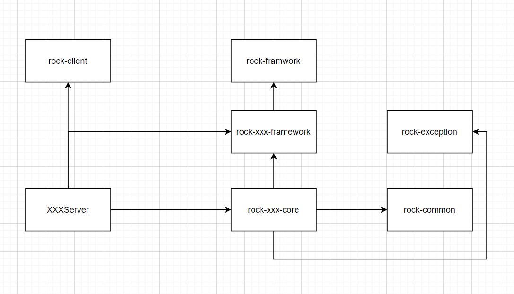
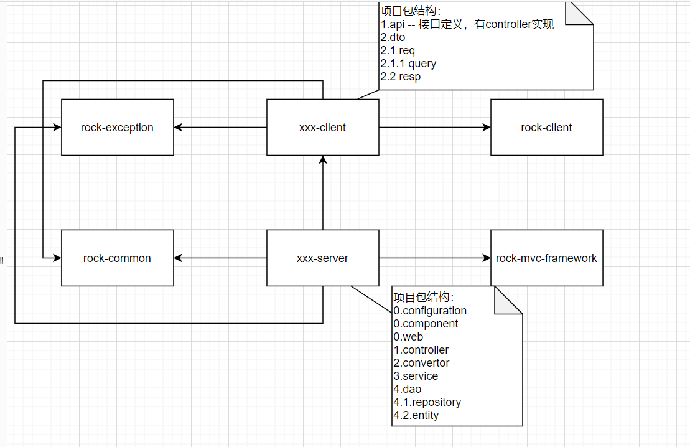

#简介
   Rock为普中智能自主研发的业务框架。目的把业务开发人员从繁重的技术基础能力剥离开来，使之更关注业务本身，统一框架使用，减低开发人员使用框架的成本。
   基于spring boot搭建而成，支持spring cloud。内置ddd与mvc开发架构，DDD由CQRS与DDD两种架构搭配而成，内含脚手架项目以及基于maven的代码生成插件。

#特性
* 支持动态加载jar包 -- 实现
* 支持按先定义模型的后生成ddd或mvc架构的代码 --实现
* 内置curd通用功能，生成后可以直接使用 -- 实现
* 支持通用逻辑的配置启用。具体通用逻辑：逻辑删除，唯一逻辑，数据验证逻辑，引用判定逻辑 -- 实现
* 支持curd的业务扩展 -- 实现
* 基于restful风格实现 -- 实现
* 支持基于框架的组件开发以及组件与系统的集成 -- 实现
* 支持自定义规则  -- 规划中
* 支持自定义状态机 -- 规划中
* 支持自定义业务流   -- 规划中

#环境要求
JDK8+版本

#技术点
* spring boot
* spring cloud
* spring web
* jpa - hibernate
* spring security
* lombok
* swagger
* jackjson
* groovy
* apache-commons
* hutools

#框架依赖

#项目结构图

